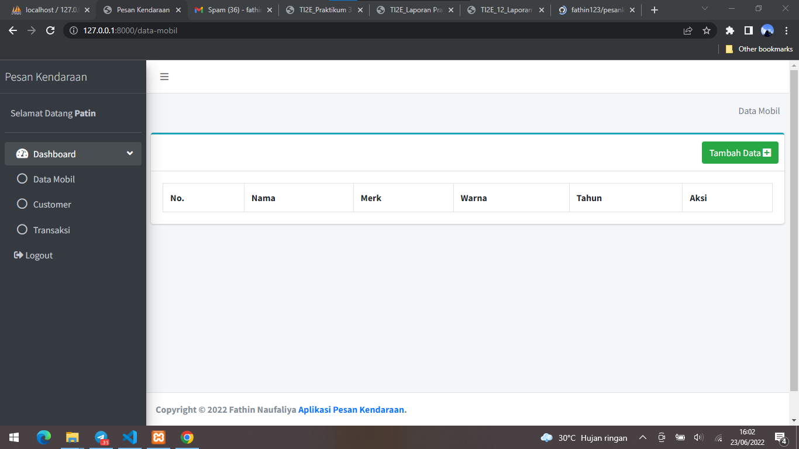
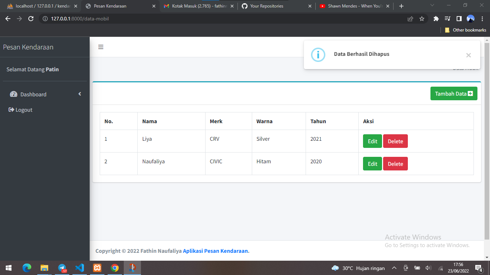
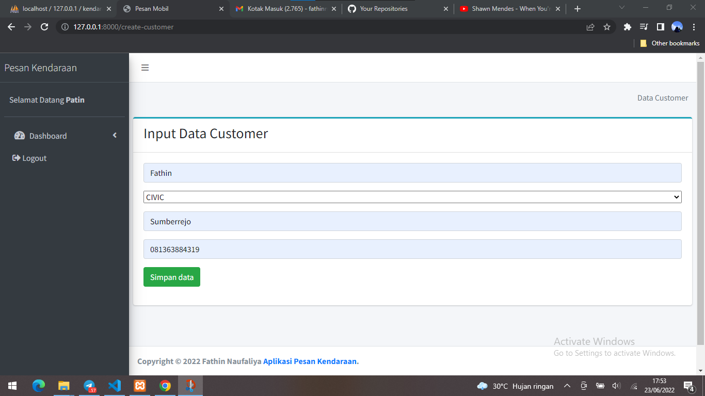
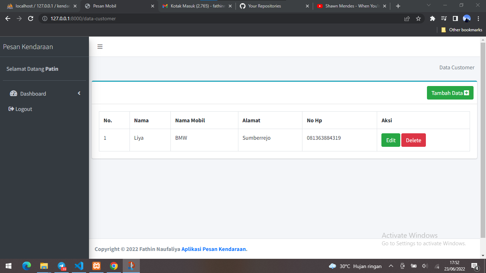
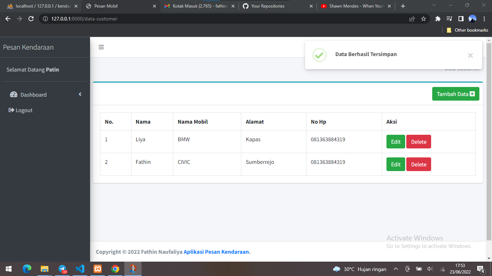
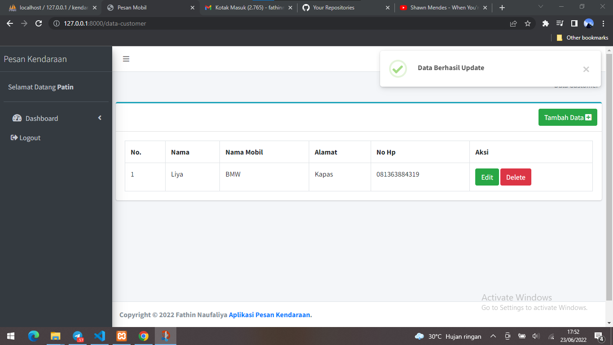
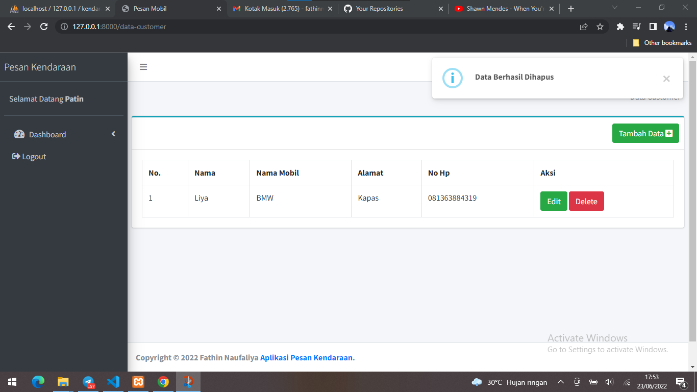

# Fathin Naufaliya - BackEnd Developer Internship

## Aplikasi Pemesanan Kendaraan berbasis Website menggunakan Laravel.

Terdapat Login dan Logout yang berhubungan dengan database.

Ada 2 user, yaitu:
1. Admin
2. User

Terdapat 3 menu, yaitu:
1. Menu Data Mobil
2. Menu Customer
3. Menu Transaksi

Dimana Menu Data Mobil, Menu Customer dan Menu Transaksi nantinya akan berelasi.

### Data Mobil

### Customer

